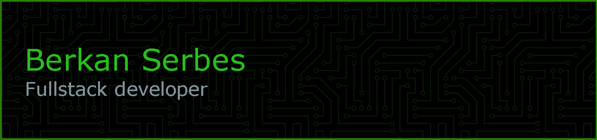

 
      
    
    
    

## :man_technologist: About Me
Hi, I'm Berkan — a full-stack developer who enjoys building clean, efficient, and user-focused applications. I care about creating software that solves real problems and delivers real value.

For me, programming languages and frameworks are just tools. What matters most is understanding the fundamentals and using them to build scalable and reliable solutions.

Outside of coding, I enjoy sharing what I learn. I write articles on [Medium](http://www.medium.com/@berkanserbes) to explore new trends, reflect on real-world experiences, and contribute to the tech community.

## :computer: Tech Stack
### Frontend 

### Backend 

### Mobile 

### Other

<!--  -->

## :pencil: Latest Blog Posts
<!-- BLOG-POST-LIST:START -->
- [Clean Code Bölüm 9: Unit Tests](https://medium.com/@berkanserbes/clean-code-b%C3%B6l%C3%BCm-9-unit-tests-514a0ee4f018?source=rss-6300fe4bff09------2)
- [Creational Tasarım Desenleri: Builder Tasarım Deseni](https://medium.com/@berkanserbes/creational-design-pattern-builder-tasar%C4%B1m-deseni-c3ec90fe348d?source=rss-6300fe4bff09------2)
- [Repository Pattern](https://medium.com/@berkanserbes/repository-pattern-e377bc1059c5?source=rss-6300fe4bff09------2)
- [Clean Code Bölüm 8: Sınırlar](https://medium.com/@berkanserbes/clean-code-b%C3%B6l%C3%BCm-8-s%C4%B1n%C4%B1rlar-eca04f68adfd?source=rss-6300fe4bff09------2)
- [Creational Tasarım Desenleri: Abstract Factory Tasarım Deseni](https://medium.com/@berkanserbes/creational-tasar%C4%B1m-desenleri-abstract-factory-tasar%C4%B1m-deseni-64f56b64fa74?source=rss-6300fe4bff09------2)
<!-- BLOG-POST-LIST:END -->

 

Github stats

